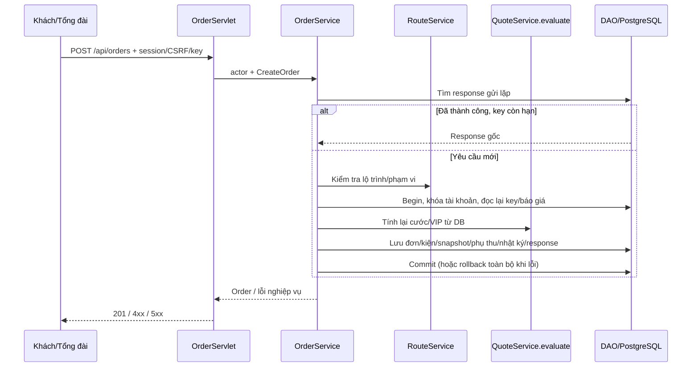

# T10 — Tạo đơn (UC-02)

`POST /api/orders` đã triển khai, cần session của KHACH_HANG/TONG_DAI, `X-CSRF-Token` và `Idempotency-Key` (1–100 ký tự). Request/response chuẩn nằm trong [OpenAPI](../src/backend/src/main/webapp/openapi.json). Tổng đài phải chọn `maKh`; khách bỏ `maKh` hoặc truyền chính ID của mình. Quyền lợi VIP thuộc khách này; người thao tác được lưu riêng trong nhật ký bằng ID tài khoản, vai trò và tên. `maNv` ghi tổng đài tạo hộ.

Luồng thử: đăng nhập → lấy CSRF mới → `POST /api/quotes` → lấy `maBaoGia` → `POST /api/orders` với cùng địa chỉ và kiện hàng, thêm SĐT người nhận và khóa gửi lặp. BE không nhận tiền, cờ VIP hoặc trạng thái do client gán; field ngoài contract trả 400. SĐT chuẩn hóa như T06 (`+84` thành `0`, đúng 10 chữ số). Lỗi nghiệp vụ dùng Error DTO chung.

## Kiểm tra báo giá

BE gọi RouteService trước transaction ghi; bên trong transaction kiểm tra chủ sở hữu báo giá, thời hạn, lộ trình/kiện đã chuẩn hóa, rồi dùng lại `QuoteService.evaluate`, FareCalculator và MembershipPolicyService để tính theo DB. Đúng 300 giây là hết hạn. Báo giá hết hạn trả 409 QUOTE_EXPIRED; dữ liệu/biểu phí/cước/hạng thay đổi trả 409 QUOTE_CHANGED. Client lấy báo giá mới và xác nhận lại, không tự động chấp nhận giá khác. Thiếu báo giá/khách trả 404; ngoài vùng 422; provider lỗi/timeout 502/504; thiếu biểu phí 503.

## Transaction và chống gửi lặp

`OrderService` → `DonHangDAO.persistAggregate` lưu đơn UUID/CHO_GAN, kiện hàng, snapshot cước, từng phụ thu và nhật ký ban đầu. Snapshot giữ tiền, tên biểu phí, tên/tỷ lệ VIP thực sự áp dụng. Không gán tài xế. Cước bằng 0 trả MIEN_CUOC, không tạo lần thanh toán.

Migration V4 thêm `order_creation_request`: ID SHA-256 của tài khoản + operation + key, request chuẩn hóa, response gốc, FK đơn/tài khoản và hạn 24 giờ. Response và toàn bộ aggregate commit cùng transaction. Lỗi bất kỳ bước nào rollback tất cả, key có thể retry. UUID và các khóa chính/unique DB bảo vệ tính duy nhất.

Khóa ghi tài khoản (`PESSIMISTIC_WRITE`) chỉ trong giai đoạn DB ngắn, sau tra lộ trình, để hai lần đầu dùng cùng key không cùng tạo đơn. Khóa này tuần tự hóa các yêu cầu tạo đơn cùng tài khoản; không khóa mọi người dùng. Sau khi chờ khóa phải đọc lại kết quả idempotency.

Cùng tài khoản/key/payload chuẩn hóa trả nguyên HTTP 201/body gốc, kể cả báo giá hết hạn hoặc provider hỏng. Khác payload trong 24 giờ trả 409 IDEMPOTENCY_CONFLICT. Key của tài khoản khác độc lập. Từ đúng 24 giờ, key được phép tái sử dụng với báo giá còn hợp lệ; bản ghi được thay thế, đơn cũ giữ nguyên. Khóa khác biểu thị ý định tạo đơn khác, kể cả dùng lại một báo giá còn hạn. Không tự xóa lịch sử đơn.

## Truy vết thiết kế

Mapping: OrderServlet (HTTP/DTO), OrderService (quyền, báo giá, transaction), QuoteService.evaluate (cước dùng chung T09), DonHangDAO (aggregate), OrderCreationRequestDAO (khóa/replay), OrderCreationRequest (V4). T06 ApiSecurityFilter tiếp tục kiểm tra session/role/CSRF.

Phạm vi T10 ở đây là tạo đơn. T11 bổ sung đọc danh sách/chi tiết đơn; `listCustomers` và API đọc nhật ký còn planned trong OpenAPI. Kết quả test và lệnh chạy ở [tests/T10-validation.md](../tests/T10-validation.md). Review/merge theo CONTRIBUTING do nhóm thực hiện.
