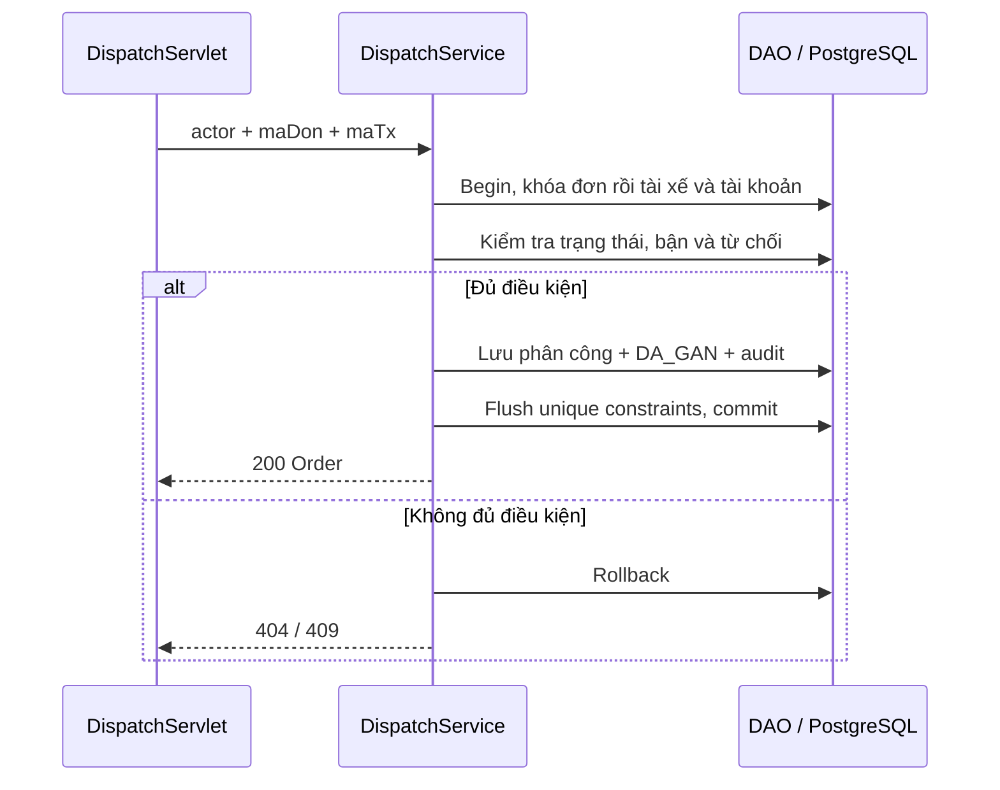

# T11 — Điều phối, gán và từ chối đơn (UC-12)

Phụ thuộc T10 đã merge vào `develop`. Luồng Controller → DispatchService → DAO dùng cùng EntityManager trong TransactionRunner. API dùng session T06; các POST bắt buộc `X-CSRF-Token`. Chỉ POST thực hiện gán/từ chối; HEAD không được thay đổi dữ liệu.

| API | Quyền | Kết quả |
| --- | --- | --- |
| `GET /api/orders` | Khách / Tổng đài / Tài xế | OrderPage theo quyền, trạng thái, ngày và phân trang |
| `GET /api/orders/{maDon}` | Khách sở hữu / Tổng đài / Tài xế liên quan | Order với cước snapshot, kiện hàng và payment summary |
| `GET /api/drivers` | Tổng đài | DriverPage, có lọc trạng thái và `dangBanChuyen` |
| `GET /api/orders/{maDon}/driver-suggestions` | Tổng đài | DriverPage gợi ý cho đơn CHO_GAN |
| `POST /api/orders/{maDon}/assignments` | Tổng đài | `{ "maTx": "TX-DEMO-1" }` → Order DA_GAN |
| `POST /api/orders/{maDon}/reject` | Tài xế hiện được gán | `{ "lyDo": "Xe gặp sự cố" }` → Order CHO_GAN |

## Danh sách và quyền truy cập

Phân trang bắt đầu từ 0, size 1–100. Đơn sắp xếp `thoiGianTao DESC, maDon ASC`. `tuNgay` bao gồm và `denNgay` không bao gồm, tính theo Asia/Ho_Chi_Minh; ngày sai hoặc khoảng ngày đảo/ bằng nhau trả 400 DATE_RANGE_INVALID. Bộ lọc một phía được phép. Summary tính số đơn và tổng cước snapshot trên toàn bộ tập lọc, gồm đơn hủy; không coi tổng cước là doanh thu.

Khách chỉ thấy đơn của mình. Tổng đài thấy các đơn để điều phối. Tài xế thấy đơn hiện được giao và lịch sử phân công không bị từ chối; sau khi từ chối không còn quyền xem đơn đó, trừ khi còn lịch sử hợp lệ khác. Chi tiết sai chủ trả 404 để không lộ dữ liệu. Không trả CCCD, giấy phép hoặc dữ liệu tài khoản trong Driver DTO.

`GET /api/drivers?trangThaiHoatDong=ONLINE&dangBanChuyen=false` lấy tài xế rảnh. Chỉ trả tài khoản hoạt động; sắp xếp `hoTen, maTx`. Bận nếu có phân công chưa kết thúc hoặc đơn DA_GAN/DA_LAY_HANG/DANG_GIAO còn liên kết tài xế. Vehicle có thể null theo hợp đồng.

## Gợi ý và gán

Gợi ý chỉ cho CHO_GAN: ONLINE, tài khoản hoạt động, không bận, chưa từ chối chính đơn này. Ưu tiên `ranhTu ASC NULLS LAST`, rồi `maTx ASC`. Người đã từ chối đơn bị loại khỏi cả gợi ý và gán thủ công cho đơn đó; vẫn có thể nhận đơn khác. Không có tài xế trả HTTP 200, `items=[]`, totalElements/totalPages=0. Gợi ý không giữ chỗ; điều kiện phải kiểm tra lại khi gán.

Thứ tự khóa ghi: **đơn → tài xế → tài khoản của tài xế**. Sau khi lấy khóa, kiểm tra lại trạng thái đơn, phân công, ONLINE và trạng thái tài khoản. Chuyển CHO_GAN → DA_GAN, liên kết tài xế, đặt `ranhTu=null`, thêm PhanCongDonHang và nhật ký người thao tác trong cùng transaction. `maNv` giữ người tạo đơn theo T10; người gán được lưu riêng trong phân công và nhật ký.

Các partial unique index V2 `uq_pc_active_order` và `uq_pc_active_driver` bảo vệ thêm ở DB: một đơn/tài xế chỉ có một phân công chưa kết thúc. Request cạnh tranh cùng đơn thua trả 409 ORDER_STATE_CONFLICT; tài xế vừa bận/khóa/offline hoặc đã từ chối đơn trả 409 DRIVER_UNAVAILABLE. Không tạo lịch sử hoặc audit cho thao tác thất bại. Request gán lặp không tạo phân công mới; trả 409 sau lần gán thành công.

## Từ chối

Chỉ tài xế đang được gán và đơn DA_GAN được từ chối. Lý do sau trim phải 1–500 ký tự. Transaction khóa đơn và tài xế, kết thúc phân công, lưu lý do/`tuChoi=true`, xóa liên kết tài xế trên đơn, chuyển về CHO_GAN, đặt `ranhTu=now`, ghi nhật ký và commit. Sai tài xế trả 404; đã lấy hàng/đang giao trả 409 ORDER_STATE_CONFLICT. Lỗi DB ở bất kỳ bước nào rollback toàn bộ.

Migration V5 thêm cờ `tu_choi` và CHECK bắt buộc thời điểm kết thúc/lý do cho phân công bị từ chối. Phân công cũ giữ `false`; không suy diễn lý do kết thúc cũ thành từ chối. V6 sửa riêng fixture `PC-DEMO-REJECTED` đã biết là từ chối; DemoSeeder cũng đặt cờ tương ứng. Dữ liệu đơn, snapshot giá và kiện hàng không đổi khi gán/từ chối.

## Kiểm thử và phần tích hợp tiếp theo

Xem [kết quả T11](../tests/T11-validation.md). JUnit chạy PostgreSQL thật, kiểm tra gán/từ chối/rollback/phân quyền và cạnh tranh. HTTP smoke kiểm tra WAR trên Tomcat, filter với wildcard `/api/orders/*`, CSRF và schema OpenAPI. Postman được sinh lại từ spec và bỏ planned guard cho 6 operation trên.

JUnit đã kiểm tra gán cạnh tranh transaction hủy bằng fixture DB, chưa gọi API hủy. T12 triển khai chuyển trạng thái/nhật ký đọc; T13 triển khai API hủy và kiểm thử tích hợp gán–hủy qua API. Các thao tác sau này phải giữ thứ tự khóa đơn rồi tài xế, cập nhật lịch sử phân công và đơn trong cùng transaction. API thanh toán/báo cáo chưa thuộc T11. Task chỉ Done sau PR được thành viên khác review, CI pass và merge theo CONTRIBUTING.
